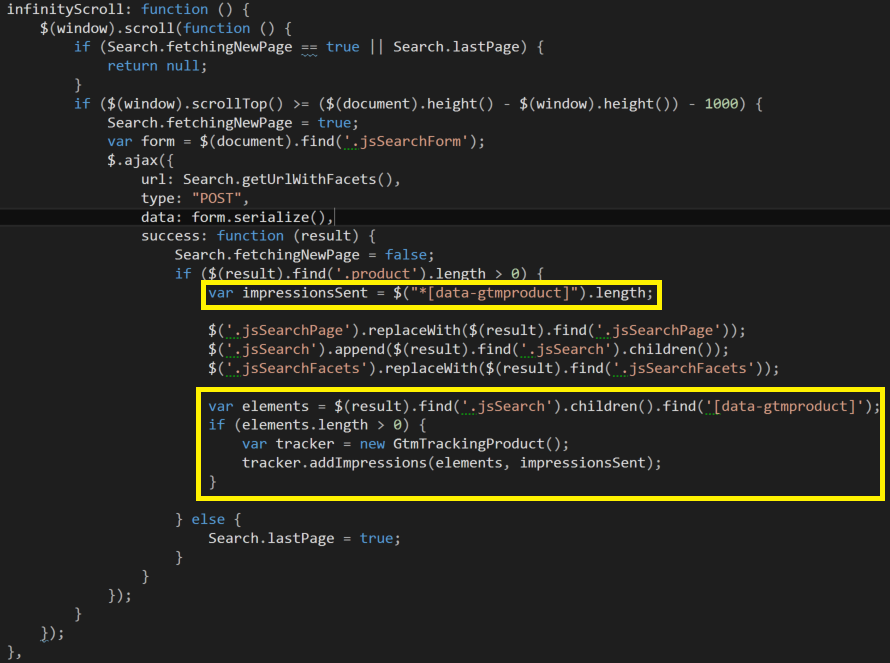

# QuickSilver examples

Here are more hands on examples using the module in an Episerver QuickSilver demo site.

## Generating the product json 
As specified in the [readme file](../README.md) : the implementation will look for attribute with name *'data-gtmproduct'* and expects the content of the attribute to be serlialized json product data.
The QuickSilver category list page renders _Product.cshtml (with IProductModel as the viewmodel) for each product item in the list.  
Notice the use of **LowercaseContractResolver** to ensure all lower case json. 

Example from _Product.cshtml:
```cshtml
@model EPiServer.Reference.Commerce.Site.Features.Shared.Models.IProductModel


<div class="@productLevelClass"  data-gtmproduct="@Helper.RenderProductJson(Model)">
	<a href="@Model.Url" class="link--black">
		<!-- .... -->
	</a>
</div>
```
The static helper method:
```c#
public static string RenderProductJson(IProductModel productModel, decimal? quantity = null)
        {
            if (productModel == null)
            {
                return string.Empty;
            }
            var product = new TrackingProduct()
            {
                Id = productModel.Code,
                Name = productModel.DisplayName,
                Price = productModel.DiscountedPrice.GetValueOrDefault().Amount,
                Brand = productModel.Brand,
                Category = productModel.Category
            };

            if (quantity != null)
                product.Quantity = (int)quantity.Value;

            var settings = new JsonSerializerSettings { ContractResolver = new LowercaseContractResolver() };
            return JsonConvert.SerializeObject(product, settings);
        }
```
This would typically result in html similar to this:

```html
<!-- a product item in the category list -->
<div class="product" data-gtmproduct="{"id":"P-38426422","name":"Short Sleeve Crew Tee",
      "price":30.5,"category":null,"brand":"Fruit of the Loom","variant":null,"position":0,"quantity":0}">
    <a href="/en/fashion/womens/womens-tees/p-38426422/" class="link--black">
        <!-- .... -->
    </a>
</div>
```

## Handling autoscroll, sorting and filtering
The product category list page in the QuickSilver demo site has both sorting, filtering and auto scroll functionality. To track product impressions you can call the addImpressions util method. 

Pushing impressions after sorting or filtering:

```js
updatePage: function (url, data, onSuccess) {
        $.ajax({
            type: "POST",
            url: url || "",
            data: data,
            success: function (result) {
                $('.jsSearchPage').replaceWith($(result).find('.jsSearchPage'));
                $('.jsSearch').replaceWith($(result).find('.jsSearch'));
                $('.jsSearchFacets').replaceWith($(result).find('.jsSearchFacets'));

                // START: gtm - push impressions to google
                var elements = $(result).find('.jsSearch').children().find('[data-gtmproduct]');
                if (elements.length > 0) {
                    var tracker = new GtmTrackingProduct();
                    tracker.addImpressions(elements, 0);
                }
		// END gtm

                if (onSuccess) {
                    onSuccess(result);
                }
            }
        });
    }
```

Autoscroll in QS demo site is handled by the **infinityScroll** function inside Search.js. Below is an example of how you can track the new products fetched from the server, by adding a few lines (the yellow ones) to Search.js:


